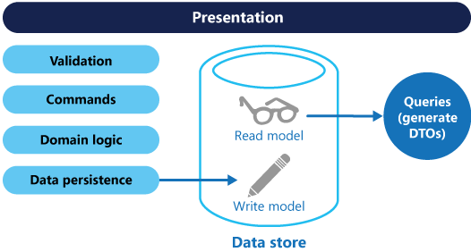

# Domain-Driven Design Architecture & CQRS (Command Query Responsibility Segregation) design pattern trong NestJS

## CQRS Design Pattern

### 1. Khái niệm

### 2. Các components trong CQRS NestJS

#### 1. Command (`ICommand`)

- **Ý nghĩa**: Yêu cầu thực hiện hành động làm thay đổi trạng thái hệ thống (intent để ghi).
- **DDD**: Chứa dữ liệu đủ để thực thi một hành vi domain (CreateEmployee, AssignDepartment…).

#### 2. CommandHandler (`@CommandHandler`)

- **Ý nghĩa**: Xử lý command, điều phối domain (gọi Aggregate/Repository), đảm bảo invariant.
- **DDD**: Thuộc Application layer, không chứa UI/Infra detail, focus orchestration.

#### 3. Query (`IQuery`)

z

- **Ý nghĩa**: Yêu cầu đọc dữ liệu, không có side-effect.
- **DDD**: Trả về DTO/ReadModel tối ưu truy vấn.

#### 4. QueryHandler (`@QueryHandler`)

- **Ý nghĩa**: Xử lý query, đọc từ read store/projection.
- **DDD**: Ở Application layer, không thay đổi domain state.

#### 5. Event / Domain Event (`IEvent`)

- **Ý nghĩa**: Sự kiện đã xảy ra trong domain (fact): EmployeeCreated, DepartmentAssigned…
- **DDD**: Được phát sinh từ Aggregate khi business thay đổi; bất biến.

#### 6. EventHandler (`@EventsHandler`)

- **Ý nghĩa**: Phản ứng với event (update read model, gửi email, tích hợp hệ thống khác).
- **DDD**: Tạo side-effect hợp lệ, thường là eventual consistency.

#### 7. Aggregate/`AggregateRoot`

- **Ý nghĩa**: Cụm entity/value object với ranh giới nhất quán; gốc (root) kiểm soát invariant.
- **DDD**: Nơi “thực sự” diễn ra business rule; có thể raise domain events.

#### 8. `Repository`

- **Ý nghĩa**: Trừu tượng hóa lưu trữ Aggregate (tải/lưu).
- **DDD**: Ẩn chi tiết DB, giữ aggregate “sạch”.

#### 9. Saga (`@Saga`) [tùy chọn]

- **Ý nghĩa**: Điều phối quy trình dài hơi qua nhiều events → commands (workflow).
- **DDD**: Process manager.

#### 10. Buses: `CommandBus`, `QueryBus`, `EventBus`

- **Ý nghĩa**: Kết nối lỏng lẻo giữa lời gọi và handler, giúp dễ mở rộng/kiểm thử.

## Quy tắc ngắn gọn

- **Command**: đặt tên theo intent (CreateEmployee), kết quả thường là id/void; idempotent nếu cần.

- **Query**: chỉ đọc, trả DTO/ReadModel; không phát sinh side-effect.

- **Event**: past-tense, bất biến; handler có thể thất bại độc lập, cần retry/idempotent.

- **Aggregate**: bảo vệ invariant; không lộ state “bừa bãi”.

- **Application layer (Handlers)**: điều phối, không nhét business rule phức tạp vào đây.

- **Read model**: tách riêng, có thể denormalize để truy vấn nhanh; chấp nhận eventual consistency.

**Ví dụ thực tế: HRM – Onboard nhân viên mới Luồng end-to-end**

- `HTTP POST /employees` → `CommandBus.execute(CreateEmployeeCommand)`

- **CommandHandler**:
   - Kiểm tra policy (email unique…), tạo Employee aggregate.
   - Aggregate raise EmployeeCreatedEvent.
   - Repository persist aggregate.

- **EventHandler** (EmployeeCreatedEvent):
   - Gửi email chào mừng hoặc tạo tài khoản hệ thống.
   - Tạo hợp đồng lao động và gửi đến email của nhân viên
   - Tạo bảng lương cho nhân viên

## Saga Pattern

Sẽ được cập nhật bổ sung trong thời gian tới
